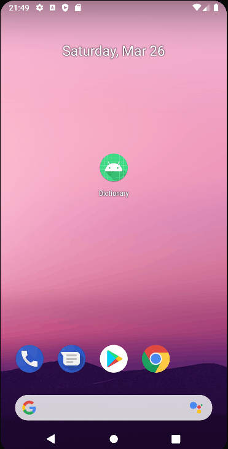
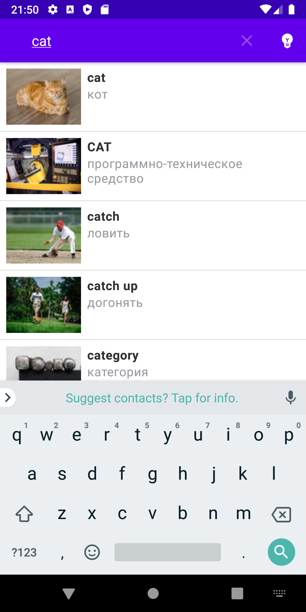

# Домашнее задание 1.
1. Создайте свой вариант Словаря с использованием MVP. Используйте RxJava и Retrofit.
2. \* Доработайте UX вашего приложения: добавьте темную тему или измените механизм поиска слов (замените SearchDialodFragment на другое решение).

# Получившийся результат.

Что было сделано:
1. Создал свой вариант словаря с использованием MVP + Moxy. 
2. Заменил SearchDialogFragment на SearchView, который вызывается из верхнего меню.
3. Добавил возможность переключения между светлой и темной темой через иконку лампы в верхнем меню.
4. Для сохранения выбранной темы в настройках создал ThemeSharedPreferencesWrapper. 

 
 

