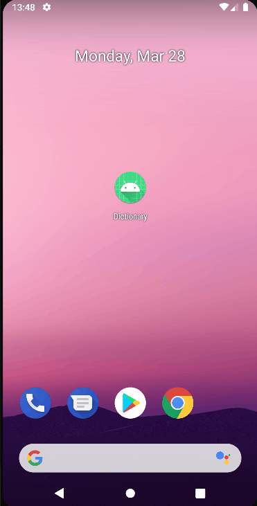

# Домашнее задание 1.
1. Создайте свой вариант Словаря с использованием MVP. Используйте RxJava и Retrofit.
2. \* Доработайте UX вашего приложения: добавьте темную тему или измените механизм поиска слов (замените SearchDialodFragment на другое решение).

# Получившийся результат.

Что было сделано:
1. Создал свой вариант словаря с использованием MVP + Moxy. 
2. Заменил SearchDialogFragment на SearchView, который вызывается из верхнего меню.
3. Добавил возможность переключения между светлой и темной темой через иконку лампы в верхнем меню.
4. Для сохранения выбранной темы в настройках создал ThemeSharedPreferencesWrapper. 

 
 

# Домашнее задание 2.
1. Используйте в своем проекте ViewModel, LiveData и Dagger. Детали UI/UX остаются на ваше усмотрение.
2. \* Мы создали дополнительную проверку на наличие связи с Интернетом в приложении. Изучите package utils и BaseActivity и имплементируйте в своём приложении.
3. \* Имплементируйте сохранение состояния приложения во ViewModel.

# Получившийся результат.

Что было сделано:
1. Заменил в проекте MVP+Moxy на MVVM.
2. Добавил в проект Dagger.
3. Реализовал в проекте проверку на наличие связи с интернетом перед поиском.
4. Реализовал сохранение состояния приложения во ViewModel, для этого использовал AssistedFactory в связке с MultiBinding-ом. По факту восстанавливается только query - это новая LiveData, которую я создал специально для этого. После восстановления идёт запрос в сеть на получение данных. 

 

# Домашнее задание 3.
1. Используйте в своём проекте Koin и Coroutines.
2. \* Изучите факультативные материалы.
3. \* Почитайте дополнительно про Coroutines Channels.

# Получившийся результат.

Что было сделано:
1. Заменил в проекте Dagger на Koin.
2. В одном месте добавил использование coroutine просто ради использования.

# Домашнее задание 4.
1. Отрефакторите приложение Секундомер: разбейте его по слоям на основе чистой архитектуры с использованием паттерна MVVM.
2. \* Добавьте в Секундомер возможность запускать сразу два таймера.
3. \* Используйте Flow для обработки запросов пользователя при вводе слова (в качестве основы используйте код Факультатив — Строка поиска).
4. \* Используйте Flow для отправки запроса в интернет и смене состояний приложения (AppState).
5. \* Почитайте про Channels и опишите принципиальную разницу между Flow и Channel.
6. \* Прочитайте про BroadcastChannel и опишите принципиальную разницу между Channel и BroadcastChannel.

# Получившийся результат.

Что было сделано:
1. Сделал рефакторинг приложения с разбивкой по слоям с использованием паттерна MVVM.
2. Добавил view binding.
3. Добавил в проект DI в виде Koin.
4. Добавил в Секундомер второй таймер. Теперь можно запускать сразу 2 таймера.